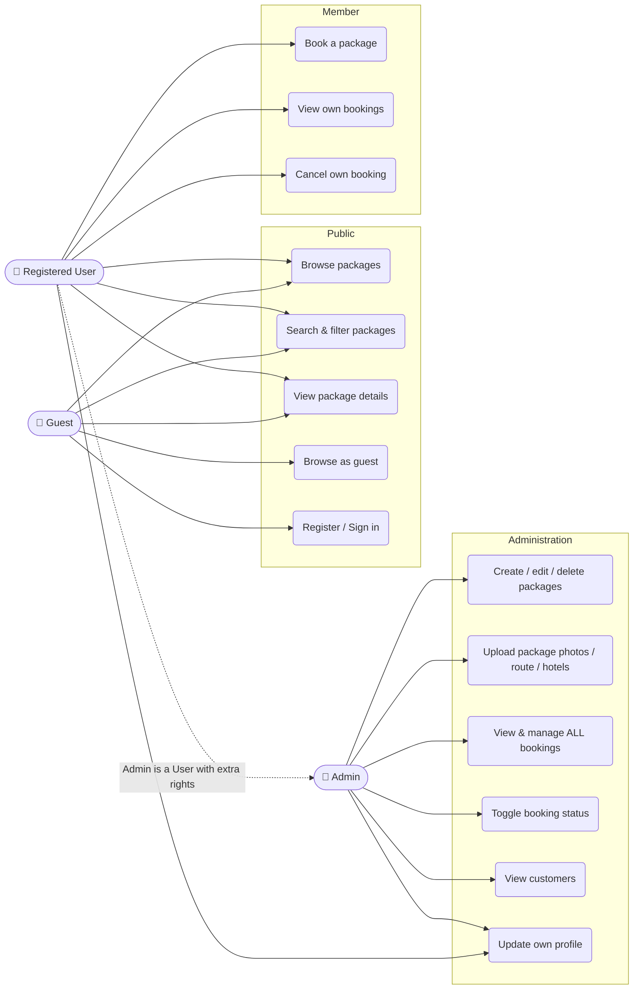
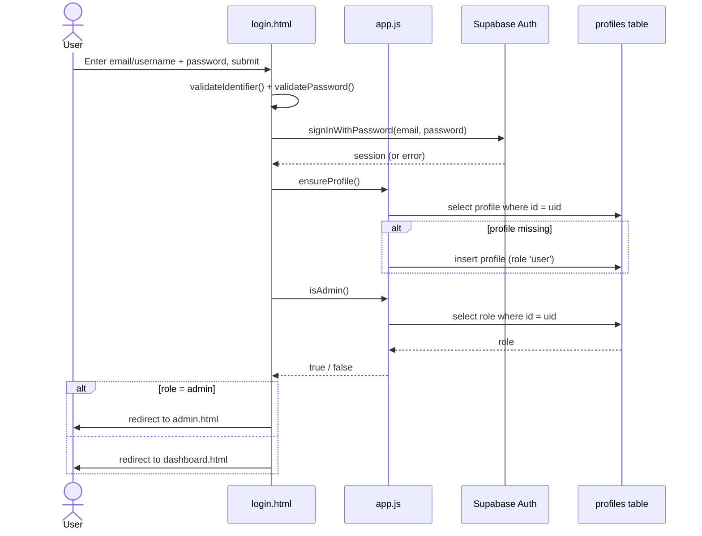
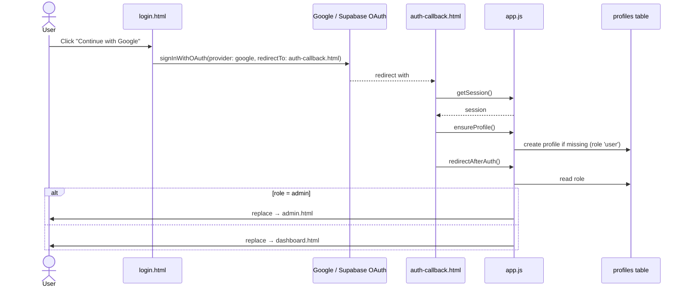
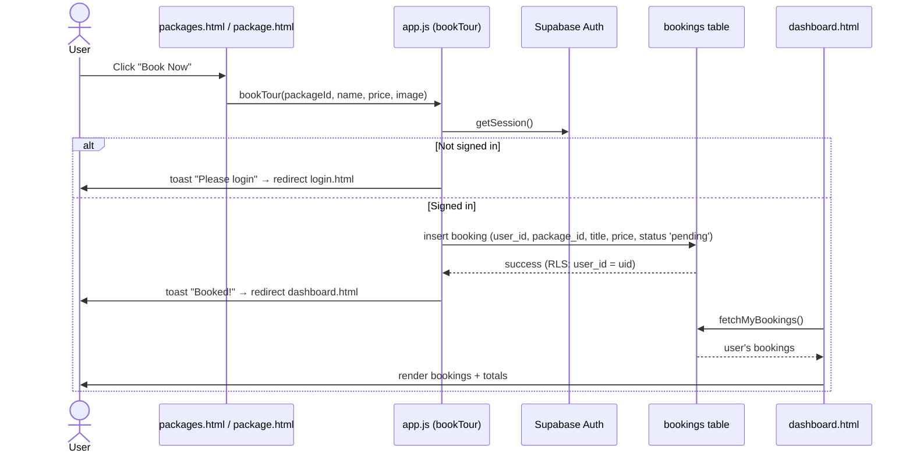
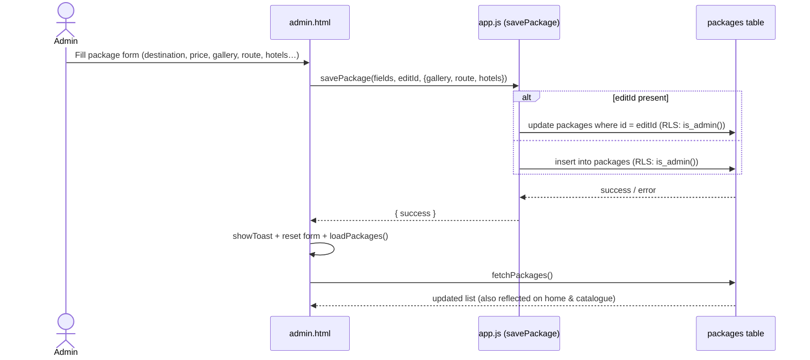
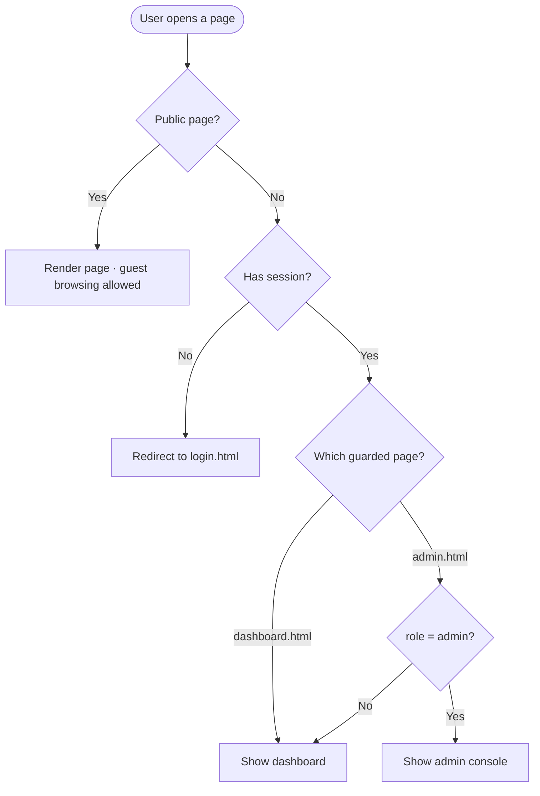
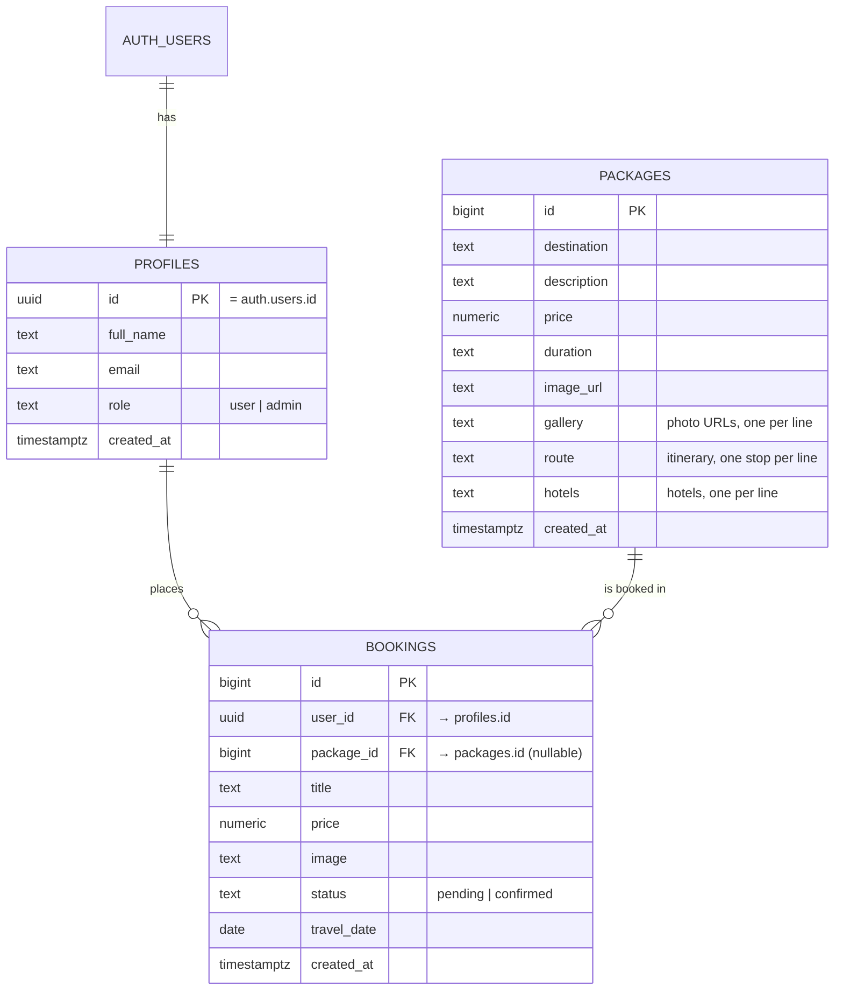

# 🌍 GlobeTrek Adventures — Travel Booking Platform

**GlobeTrek Adventures** is a luxury travel‑booking web application for a Sri Lankan
travel company based in **Negombo, Sri Lanka**. Customers browse curated tour
packages, view rich package details (photos, route, hotels), and book trips.
Administrators manage the catalogue, bookings, and customers from a dedicated console.

The front end is **plain HTML, CSS and vanilla JavaScript** (no framework, no build
step). The back end is **Supabase** (PostgreSQL + Auth + Row Level Security). There is
**no mock/demo data** — everything is read from and written to the database. Prices are
shown in **LKR**.

---

## 📑 Table of Contents
1. [Tech Stack](#-tech-stack)
2. [Feature Overview](#-feature-overview)
3. [Project Structure](#-project-structure)
4. [Site Map](#-site-map)
5. [Use‑Case Diagram (UML)](#-use-case-diagram-uml)
6. [Sequence Diagrams (UML)](#-sequence-diagrams-uml)
7. [Access‑Control Flowchart](#-access-control-flowchart)
8. [Database Design](#-database-design)
9. [Function Reference](#-function-reference)
10. [Roles & Permissions](#-roles--permissions)
11. [Setup & Installation](#-setup--installation)
12. [Security Notes](#-security-notes)
13. [Company / Contact](#-company--contact)

---

## 🧰 Tech Stack

| Layer | Technology |
|-------|------------|
| Markup | HTML5 |
| Styling | CSS3 (single `style.css`, CSS variables, glassmorphism, responsive) |
| Logic | Vanilla JavaScript (ES2020+, no framework) |
| Icons | [Lucide](https://lucide.dev) (CDN) |
| Backend | [Supabase](https://supabase.com) — PostgreSQL, Auth, Row Level Security |
| Auth providers | Google OAuth (primary) + Email/Username + Password |
| Hosting | Static hosting (e.g. Vercel) + Supabase cloud |

> Languages used: **HTML, CSS, JavaScript**, and **SQL** for the database (DDL + RLS +
> one `language sql` helper). **No PL/pgSQL.**

---

## ✨ Feature Overview

### Public site (Guest)
- **Simple homepage** with a large destination search bar and progressive filters
  (basic filters shown first: destination, check‑in, check‑out, travellers; extra
  filters such as Max Budget revealed via a "More filters" toggle).
- **Featured Escapes** on the home page — loaded live from the database (same source
  as the catalogue, so they always stay in sync).
- **Packages catalogue** (`packages.html`) — live from the database, with destination
  + budget filtering and search‑term persistence (`sessionStorage`).
- **Package details page** (`package.html`) — large hero photo, photo gallery, price,
  duration, overview, **Route & Itinerary**, and **Hotels in the Area**, plus a sticky
  booking card with a Book Now button.
- Each catalogue card has **two actions**: **Details** (→ details page) and **Book Now**.
- **Browse as Guest** option on every page so visitors can explore without registering.
- **5‑link main menu** (Home, Packages, Deals, About Us, Contact) to avoid overload.
- About page, Contact page (with a validated contact form), newsletter sign‑up.

### Authentication
- **Login with Google** as the primary, most visible option.
- **Email/Username + Password** sign‑in and **Email + Password** registration
  (name, email, password only — no payment details at sign‑up).
- **Field‑level validation on blur** with clear, actionable messages.
- **Form progress saved** in `sessionStorage` (recovered if the user navigates away);
  passwords are never stored.
- **Standard `autocomplete`** attributes for browser autofill.
- **Role‑based redirect** after sign‑in: admins → `admin.html`, users → `dashboard.html`
  (applies to both Google and email/password).

### Traveller dashboard (User)
- Shows the signed‑in user's **profile** (name, email) and **their bookings**.
- **Cancel** a booking; live totals (number of bookings, amount spent).
- Route‑guarded — only signed‑in users can view it.

### Admin console (Admin)
- **Manage Packages** — create, edit, and delete packages, including detail fields
  (photo gallery, route, hotels).
- **View Bookings** — every customer booking, with the customer's email; toggle
  status (`pending`/`confirmed`) and remove bookings.
- **Customers** — list of all registered users (name, email, role).
- **Settings** — admin updates their own display name.
- Route‑guarded — only users whose `profiles.role = 'admin'` can enter.

### Design & accessibility
- One consistent button colour across the site; destructive actions use an accessible red.
- Price is the most prominent text on cards; generous spacing around booking actions.
- Visible keyboard‑focus styles; colour contrast meets accessibility guidance.

---

## 📁 Project Structure

```
WAD_Husni/
├── index.html                  # Home: big search, featured escapes (DB), newsletter
├── packages.html               # Catalogue: live packages, filters, Details + Book Now
├── package.html                # Single package details (photos, route, hotels, booking)
├── about.html                  # About the company
├── contact.html                # Contact form + company contact info (Negombo)
├── login.html                  # Auth: Google + email/username + password, guest, validation
├── auth-callback.html          # Google OAuth redirect handler → role-based redirect
├── dashboard.html              # Traveller dashboard (their bookings) — login required
├── admin.html                  # Admin console (packages/bookings/customers/settings) — admin only
├── app.js                      # Shared engine: Supabase client + all data functions
├── env.js                      # PUBLIC config (Supabase URL + anon key + redirect URL)
├── style.css                   # All styling
├── supabase/
│   ├── schema.sql              # Full schema: tables, RLS, is_admin(), seed data
│   ├── add-package-details.sql # Migration: add gallery/route/hotels columns
│   └── remove-plpgsql-trigger.sql # Migration: drop PL/pgSQL trigger, add profile policies
├── .env                        # Secret env vars (git-ignored — service_role key)
├── .env.example                # Template for .env
├── SITEMAP.md                  # Navigation/option hierarchy reference
├── SUPABASE_BACKEND_REPORT.md  # Backend verification notes
└── README.md                   # This document
```

---

## 🗺️ Site Map

```
GlobeTrek Adventures
│
├── PUBLIC (Guest — no login)
│   ├── index.html ............ Home
│   │   ├── Nav: Home · Packages · Deals · About Us · Contact
│   │   ├── Auth nav: Browse as Guest · Login · Sign Up
│   │   ├── Hero search: Destination (big) + Check-in + Check-out + Travellers
│   │   │                 └── "More filters" → Max Budget
│   │   ├── Featured Escapes (live from DB) → "Explore Details" → package.html?id=
│   │   └── Newsletter sign-up
│   ├── packages.html ......... Catalogue
│   │   ├── Search + filter (destination / budget)
│   │   └── Package cards → [Details → package.html?id=] [Book Now]
│   ├── package.html?id= ...... Package details
│   │   ├── Gallery · Price · Duration · Overview
│   │   ├── Route & Itinerary · Hotels in the Area
│   │   └── Book Now (→ login if guest, else creates booking)
│   ├── about.html ............ About the company
│   ├── contact.html .......... Contact form + Negombo contact details
│   └── login.html ............ Auth portal
│       ├── Continue with Google (primary)
│       ├── Email/Username + Password (Sign In)  /  Name + Email + Password (Sign Up)
│       └── Browse as guest
│
├── auth-callback.html ........ Google OAuth handler (role-based redirect)
│
├── USER (login required)
│   └── dashboard.html ........ Traveller dashboard
│       ├── Profile (name, email) + metrics (bookings, amount spent)
│       └── Booked Journeys table → Cancel
│
└── ADMIN (role = 'admin' required)
    └── admin.html ............ Admin console
        ├── Manage Packages (create / edit / delete + gallery/route/hotels)
        ├── View Bookings (all customers; toggle status; remove)
        ├── Customers (all profiles: name/email/role)
        └── Settings (update own name)
```

---

## 🎭 Use‑Case Diagram (UML)



---

## 🔁 Sequence Diagrams (UML)

### 1. Email / password sign‑in (role‑based redirect)



### 2. Google OAuth sign‑in



### 3. Booking a package



### 4. Admin — create / edit a package



---

## 🚦 Access‑Control Flowchart



The guards run in the page `<head>` (in `dashboard.html` and `admin.html`) before the
body renders, so unauthorised users are redirected instantly. The same role is enforced
**server‑side** by RLS, so the database is protected even if a guard is bypassed.

---

## 🗄️ Database Design

### Entity–Relationship diagram



### Tables (kept intentionally simple)

**`profiles`** — one row per registered user.
| column | type | notes |
|--------|------|-------|
| id | uuid (PK) | equals the Supabase auth user id |
| full_name | text | from sign‑up / Settings |
| email | text | user's email |
| role | text | `'user'` (default) or `'admin'` |
| created_at | timestamptz | auto |

**`packages`** — the tours shown on the site.
| column | type | notes |
|--------|------|-------|
| id | bigint (PK) | auto |
| destination | text | title |
| description | text | short description |
| price | numeric | price (LKR) |
| duration | text | e.g. `7 Days` |
| image_url | text | main card image |
| gallery | text | extra photo URLs (one per line) |
| route | text | itinerary stops (one per line) |
| hotels | text | recommended hotels (one per line) |
| created_at | timestamptz | auto |

**`bookings`** — a trip booked by a user.
| column | type | notes |
|--------|------|-------|
| id | bigint (PK) | auto |
| user_id | uuid (FK) | → `profiles.id` |
| package_id | bigint (FK) | → `packages.id` (nullable) |
| title | text | booked destination name |
| price | numeric | price at booking time |
| image | text | image for the dashboard row |
| status | text | `'pending'` or `'confirmed'` |
| travel_date | date | optional |
| created_at | timestamptz | auto |

### Row Level Security (plain English)
- **packages** — anyone can read; only **admins** can insert/update/delete.
- **bookings** — a user reads/edits **their own**; **admins** read/edit **all**.
- **profiles** — a user reads/edits **their own** but **cannot change their own role**;
  admins can read all and change roles. A user may create only their own profile (as `'user'`).
- Admin checks use the SQL helper **`public.is_admin()`** (`language sql`, `security definer`).
- Profile rows are created by the app in **JavaScript** (`ensureProfile()`), not a trigger.

---

## 🔧 Function Reference

### `app.js` — shared engine (all exposed on `window`)

| Function | Signature | Description |
|----------|-----------|-------------|
| `showToast` | `(message, type='success')` | Shows a toast notification (`success` / `error`). |
| `getSession` | `()` → session | Returns the current Supabase session (or `null`). |
| `getCurrentProfile` | `()` → profile | Returns the signed‑in user's `profiles` row. |
| `isAdmin` | `()` → boolean | `true` if the current user's role is `admin`. |
| `ensureProfile` | `()` | Creates the user's profile row if missing (replaces the old DB trigger). |
| `redirectAfterAuth` | `(fallback='dashboard.html')` | Sends admins to `admin.html`, others to `fallback`. |
| `fetchPackages` | `()` → array | Reads all packages, ordered by id. |
| `fetchPackageById` | `(id)` → package | Reads a single package (for the details page / admin edit). |
| `savePackage` | `(destination, description, price, duration, imageUrl, editId=null, extra={})` | Creates or updates a package; `extra` may include `gallery`, `route`, `hotels`. Admin‑only (RLS). |
| `deletePackage` | `(id)` | Deletes a package. Admin‑only (RLS). |
| `createBooking` | `({packageId, title, price, image})` | Inserts a booking for the signed‑in user (redirects to login if guest). |
| `bookTour` | `(packageId, destination, price, imageUrl)` | "Book Now" handler → `createBooking` then redirect to dashboard. |
| `fetchMyBookings` | `()` → array | The signed‑in user's bookings. |
| `cancelBookingById` | `(id)` | Deletes a booking (own, or any if admin). |
| `fetchAllBookings` | `()` → array | All bookings with embedded `profiles(email, full_name)`. Admin. |
| `updateBookingStatus` | `(id, status)` | Sets a booking's status (`pending`/`confirmed`). Admin. |
| `deleteBookingById` | `(id)` | Removes a booking (admin alias of cancel). |
| `fetchAllProfiles` | `()` → array | All registered users (Customers tab). Admin. |
| `updateMyProfile` | `(fullName)` | Updates the signed‑in user's display name. |
| `initAuth` | `()` | Renders the nav auth buttons, wires logout, runs `ensureProfile` on session. |
| `bindLogoutButtons` | `()` | Attaches sign‑out handlers to nav logout buttons. |

### Page‑specific functions

**`index.html`**
- `loadFeatured()` — loads the first 3 packages from the DB into "Featured Escapes".
- `toggleAdvancedFilters()` — shows/hides the extra (Max Budget) filter.
- `validateCheckoutDate()` — ensures check‑out is at least one day after check‑in.
- `submitHeroSearch()` — validates dates, then navigates to the catalogue with query params.

**`packages.html`**
- `filterTours()` — fetches packages, filters by destination/budget, renders cards
  (each with **Details** and **Book Now**), persists the search in `sessionStorage`.
- `toggleAdvancedFilters()` — extra‑filter toggle.

**`package.html`**
- Loader reads `?id=`, calls `fetchPackageById`, and `renderPackage()` builds the
  headline, gallery, sticky booking card, overview, route, and hotels sections.

**`login.html`**
- `validateName()`, `validateIdentifier()`, `validatePassword()` — on‑blur field validation.
- `toggleAuthMode(signUp)` — switches between Sign In and Sign Up.
- `setSubmitIcon(name)` — safely swaps the submit‑button icon.
- `saveDraft()` / `restoreDraft()` / `clearDraft()` — `sessionStorage` form persistence.
- Submit handler: Google OAuth, email/password sign‑in & sign‑up, `ensureProfile`,
  role‑based redirect.

**`auth-callback.html`**
- Extracts the OAuth session, runs `ensureProfile`, then `redirectAfterAuth`.

**`dashboard.html`**
- `renderProfile(user, profile)` — fills sidebar/header.
- `loadBookings()` — `fetchMyBookings` → table + metrics.
- `cancelBooking(id)` — `cancelBookingById` → refresh.

**`admin.html`**
- `handleRouting()` — hash router for the tabs (`#packages`, `#bookings`, `#customers`, `#settings`).
- `loadPackages()` / `editPackage(id)` / `triggerDelete(id)` + form submit → `savePackage`.
- `loadBookings()` / `toggleBookingStatus(id, status)` / `cancelCustomerBooking(id)`.
- `loadCustomers()` — `fetchAllProfiles` → table.
- `loadSettings()` + form submit → `updateMyProfile`.

---

## 👥 Roles & Permissions

| Capability | Guest | User | Admin |
|------------|:-----:|:----:|:-----:|
| Browse / search packages | ✅ | ✅ | ✅ |
| View package details | ✅ | ✅ | ✅ |
| Book a trip | ❌ | ✅ | ✅ |
| View / cancel **own** bookings | ❌ | ✅ | ✅ |
| Update own profile name | ❌ | ✅ | ✅ |
| Create / edit / delete packages | ❌ | ❌ | ✅ |
| Upload package photos / route / hotels | ❌ | ❌ | ✅ |
| View & manage **all** bookings | ❌ | ❌ | ✅ |
| View all customers | ❌ | ❌ | ✅ |

---

## 🚀 Setup & Installation

### 1. Create the database
In **Supabase Dashboard → SQL Editor → New query**, paste and **Run**
[`supabase/schema.sql`](supabase/schema.sql). This creates the 3 tables, RLS policies,
the `is_admin()` helper, and seed packages.

> If you already have data, run the smaller migrations instead of the full schema:
> - [`supabase/add-package-details.sql`](supabase/add-package-details.sql) — adds
>   `gallery` / `route` / `hotels` columns.
> - [`supabase/remove-plpgsql-trigger.sql`](supabase/remove-plpgsql-trigger.sql) — drops
>   the old PL/pgSQL trigger and adds the profile insert/role policies.

### 2. Configuration
`env.js` holds the **public** Supabase URL and anon key (safe for the browser; protected
by RLS). The **secret** `service_role` key lives only in `.env` (git‑ignored) and must
**never** appear in the front end.

### 3. Enable Google login
**Supabase → Authentication → Providers → Google**: enable and add your OAuth client
ID/secret. Add the redirect URLs under **URL Configuration**:
- Production: `https://<your-domain>/auth-callback.html`
- Local: `http://localhost:5500/auth-callback.html`

### 4. Become an admin
1. Sign up once in the app (creates your profile).
2. In the SQL Editor: `update public.profiles set role = 'admin' where email = 'you@example.com';`
3. Open `admin.html`.

### 5. Run locally
```bash
python -m http.server 5500
# then open http://localhost:5500/index.html
```

---

## 🔐 Security Notes
- The **anon key** is public by design; data is protected by **RLS** policies.
- The **service_role key** is secret — only in `.env`, never in client code.
- Admin rights come from `profiles.role`, enforced **server‑side** by RLS; a user
  **cannot promote themselves** to admin.
- Page guards prevent UI access; RLS prevents data access — defence in depth.

---

## 🏢 Company / Contact

**GlobeTrek Adventures** — based in **Negombo, Sri Lanka**.

- 📍 Lewis Place, Negombo 11500, Sri Lanka
- 📞 +94 31 223 4567
- ✉️ support@globetrek.lk

---

*Built with HTML, CSS, JavaScript, and Supabase. Documentation last updated for the
Negombo (Sri Lanka) release.*
